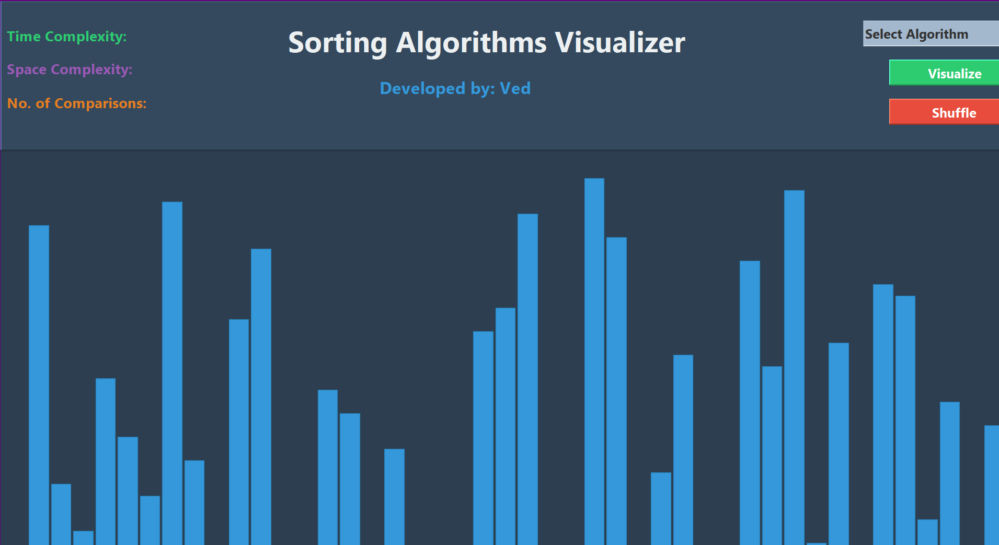

# Sorting Algorithms Visualizer - Enhanced by Ved
A modern, interactive visualization tool for different sorting algorithms including **Bubble Sort**, **Heap Sort**, **Insertion Sort**, **Merge Sort**, and **Radix Sort**.





## ✨ **New Features & Enhancements**

### 🎨 **UI/UX Improvements**
- **Modern Color Scheme**: Professional dark blue theme with color-coded elements
- **Enhanced Typography**: Segoe UI fonts for better readability
- **Improved Buttons**: Styled with modern colors and 3D effects
- **Better Visualization**: Anti-aliased rendering with bordered rectangles
- **Responsive Design**: Non-resizable window for consistent layout

### 🔢 **New Sorting Algorithm**
- **Radix Sort**: Added as the 5th sorting algorithm option
  - Time Complexity: O(d(n+k)) where d is the number of digits
  - Space Complexity: O(n+k)
  - Perfect for integer sorting with excellent performance

### 🎯 **Color-Coded Information Display**
- **Time Complexity**: Green text for easy identification
- **Space Complexity**: Purple text for visual distinction
- **Comparisons**: Orange text to track algorithm performance
- **Developer Credit**: Blue accent highlighting

## 🚀 **Installation**

### **Windows**
1. Ensure Java JDK is installed on your system
2. Check Java installation:
```bash
javac -version
```

If Java is not installed, download and install from [Oracle's official website](https://www.oracle.com/java/technologies/downloads/) or use OpenJDK.

### **Linux (Ubuntu)**
First update your apt package manager:
```bash
sudo apt update
```

Check if Java is already installed:
```bash
javac -version
```

If Java is not already installed, you'll get the following message:
```bash
Output
Command 'java' not found, but can be installed with:

sudo apt install default-jre              # version 2:1.11-72build1, or
sudo apt install openjdk-11-jre-headless  # version 11.0.14+9-0ubuntu2
sudo apt install openjdk-17-jre-headless  # version 17.0.2+8-1
sudo apt install openjdk-18-jre-headless  # version 18~36ea-1
sudo apt install openjdk-8-jre-headless   # version 8u312-b07-0ubuntu1
```

Execute the following command to install the JDK:
```bash
sudo apt install default-jdk
```

Verify that the JDK is installed by checking the version of javac:
```bash
javac -version
```

If successful, you'll see output like:
```bash
Output
javac 11.0.14
```

### **macOS**
Install Java using Homebrew:
```bash
brew install openjdk
```

## 🎮 **Usage**

1. **Download and extract the project**:
```bash
# Extract the project to your desired location
cd sorting-algorithms-visualizer-main
```

2. **Compile the Java files**:
```bash
javac -d . src/*.java
```

3. **Run the application**:
```bash
java Main
```

## 📊 **Available Sorting Algorithms**

| Algorithm | Time Complexity | Space Complexity | Best For |
|-----------|----------------|------------------|----------|
| **Bubble Sort** | O(n²) | O(1) | Educational purposes |
| **Heap Sort** | O(n log n) | O(1) | In-place sorting |
| **Insertion Sort** | O(n²) | O(1) | Small datasets |
| **Merge Sort** | O(n log n) | O(n) | Stable sorting |
| **Radix Sort** | O(d(n+k)) | O(n+k) | Integer sorting |

## 🎨 **Features**

- **Real-time Visualization**: Watch sorting algorithms in action with smooth animations
- **Performance Metrics**: Live comparison count and complexity information
- **Interactive Controls**: Easy algorithm selection and array shuffling
- **Professional UI**: Modern design with intuitive user experience
- **Cross-platform**: Works on Windows, Linux, and macOS

## 🛠️ **Technical Details**

- **Language**: Java
- **GUI Framework**: Swing
- **Rendering**: Custom graphics with anti-aliasing
- **Animation**: Thread-based with configurable delays
- **Data Structure**: ArrayList for dynamic array management

## 👨‍💻 **Developer**

**Enhanced by: Ved**

This project was originally created and has been significantly enhanced with modern UI/UX improvements, additional algorithms, and better code organization.

## 📝 **License**

This project is available for educational and personal use.

---

**Enjoy exploring the fascinating world of sorting algorithms with this enhanced visualizer! 🎉**

